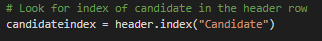
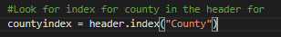
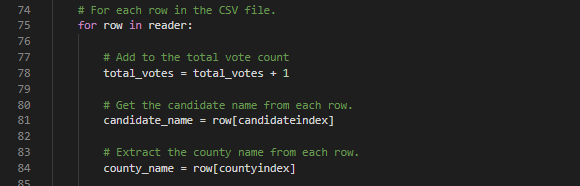
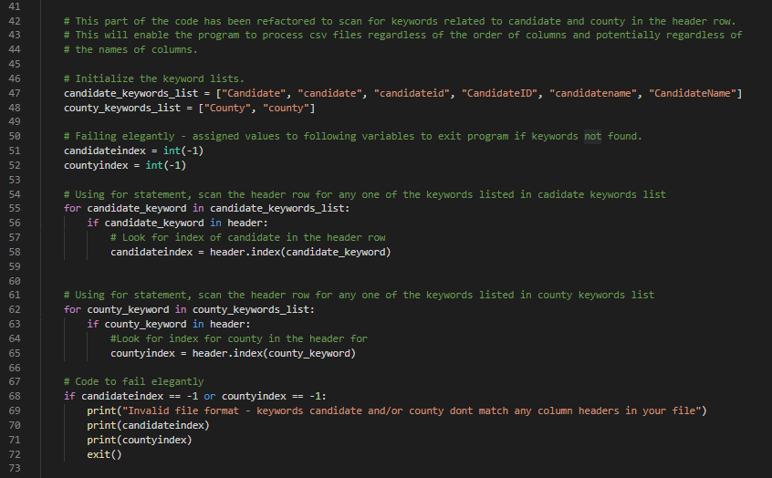

# Election Audit Analysis

## Overview 
This analysis project is to perform an election audit for a local congressional district. The election commission also wishes to automate the process so that it may be used to audit other election results. 

### Purpose 
The purpose of this analysis is to generate a vote count report to certify this congressional race by determining and reporting:

* The total number of votes casted
* The voter turnout count and percentage of votes for each county
* The county with the highest turnout
* The list of candidates who received votes
* The total number of votes and percentage of votes each candidate won
* The winner of the election based on popular vote

## Analysis 

Data Source: [Elections Data Set](Resources/election_results.csv)

Software used: Python 3.7.6, Visual Studio Code v1.52.1

Analysis Code: [PyPoll_Challenge](PyPoll_Challenge.py)

## Results

Above is the screenshot of the analysis results written to a text file which can be found here: [Election Results](Analysis/election_results.txt)

* **Total Votes**
        
        There were 369,711 total votes casted in this election.

* **County Voter Turnout**

        The three counties in this precinct and their voter turnouts are as follows:
            Jefferson - 38,855 votes or 10.5% of the total votes.
            Denver - 206,055 votes or 82.8% of the total votes.
            Aprapahoe - 24,801 votes or 6.7% of the total votes.

* **Largest County Voter Turnout**

        Denver had the largest number of voter turnout with 82.8% of the total casted votes. 

* **Candidates and Respective Vote Counts**

        The three candidates and their votes they received are as follows:
            Charles Casper Stockholm - 85,213 votes or 23% of the total votes.
            Diana DeGette - 272,892 votes or 73.8% of the total votes.
            Raymon Anthony Doane - 11,606 votes or 3.1% of the total votes.

* **Election Winner**

        Diana DeGette won the election in this precinct. 
        She received 272,892 votes, which is 73.8% of the total votes casted in the election. 

## Summary

[//]: # "In a summary statement, provide a business proposal to the election commission on how this script can be used—with some 
modifications—for any election. Give at least two examples of how this script can be modified to be used for other elections"

There is a number of ways this script can be modified to automate the process of analysizing election results. Here are two ways this can be done:

### Using variables to find the index for "Candidate" and "County" in the header list
Using index method to retrieve the index of "Candidate" and "County" will allow the program to find the right column regardless of the order of the columns in a csv file. The code will scan through the header row to find the keyword and save the index of the keyword in a variable called *candidateindex* and *countyindex* (as shown below):

This variable then can be used in the for loops later to caculate the total votes for each candidate and county (as shown below).

### Using a keyword list to loop through the column header to find the right index
The election result files may also have variations of the keywords "Candidate" and "County" in their header row. This script can be further modified to loop through a keyword list to look for any of these variations, find the right column, and save the index (As shown on line 55 and line 62).

A code for failing the if statement was added (line 68) to ensure the program exits if it cannot find the keywords in the header row. 

There are many more ways this script can be automated. For example, taking user input for various purposes, such as: file names, file paths, adding more keywords to the keywords list, can further help the election commission use this code to analyze different files, regardless of the naming of the headers or arrangement of the data in the files.  
