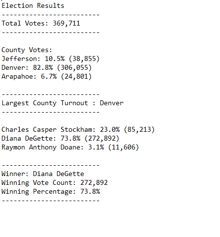

# Election Audit Analysis

## Overview 
A Colorado Board of Elections employee has been tasked to do an election audit for a local congressional district. The election commission also wishes to automate the process so that it may be used to audit other elections as well.

### Purpose 
The purpose of this analysis is to generate a vote count report to certify this congressional race by determining and reporting:

* The total number of votes cast
* The voter turnout count for each county and percentage of votes from each county out of the total 
* The county with the highest turnout
* The list of candidates who received votes
* The total number of votes that each candidate received
* The percentage of votes for each candidate won
* The winner of the election based on popular vote

## Analysis 

Data Source: [Elections Data Set](Resources/election_results.csv)

Software used: Python 3.7.6, Visual Studio Code v1.52.1

Analysis Code: [PyPoll_Challenge](PyPoll_Challenge.py)

## Results

The above is the screenshot of the analysis results printed on a text file which can be found here: [Election Results](Analysis/election_results.txt)

* **Total Votes**
        
        There were 369,711 total votes cast in this election.

* **County Voter Turnout**

        The three counties in this precinct and their voter turnouts are as follows:
            Jefferson - 38,855 votes or 10.5% of the total votes
            Denver - 206,055 votes or 82.8% of the total votes
            Aprapahoe - 24,801 votes or 6.7% of the total votes

* **Largest County Voter Turnout**

        Denver had the largest number of voter turnout with 82.8% of the total casted votes. 

* **Candidates and Respective Vote Counts**

        The three candidates and their votes they received are as follows:
            Charles Casper Stockholm - 85,213 votes or 23% of the total votes
            Diana DeGette - 272,892 votes or 73.8% of the total votes 
            Raymon Anthony Doane - 11,606 votes or 3.1% of the total votes

* **Election Winner**

        Diana DeGette won the election in this precinct. She received 272,892 votes, which is 73.8% of the total votes cast in the election. 

## Summary

[//]: # "In a summary statement, provide a business proposal to the election commission on how this script can be used—with some 
modifications—for any election. Give at least two examples of how this script can be modified to be used for other elections
There is a statement to the election commission on how this script can be used for any election with two examples given."